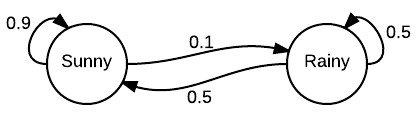
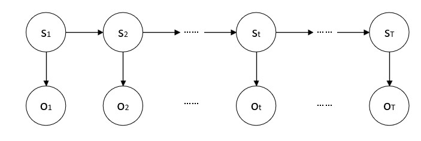

# NLP_pratice
NLP 李汇川的个人实战
## HMM——定义和假设
在正式讲解隐马尔可夫模型（Hidden Markov Model，HMM）之前，有几个概念需要搞清楚。
概率模型（Probabilistic Model）所谓概率模型，顾名思义，就是将学习任务归结于计算变量的概率分布的模型。

概率模型非常重要。在生活中，我们经常会根据一些已经观察到的现象来推测和估计未知的东西——这种需求，恰恰是概率模型的推断（Inference）行为所做的事情。

推断（Inference）的本质是：利用可观测变量，来推测未知变量的条件分布。

### 生成模型 VS 判别模型
既然概率模型是通过可观测变量推断部分未知变量，那么我们将可观测变量的集合命名为 
O，我们感兴趣的未知变量的集合命名为 Y。
生成模型学习出来的是 O与 Y的联合概率分布 P(O,Y)，而判别模型学习的是条件概率分布：P(Y|O)。

### 概率图模型（Probabilistic Graphical Model）
在概率图模型中，一般用节点来表示一个或者一组随机变量，而节点之间的边则表示两个（组）变量之间的概率相关关系。

边可以是有向（有方向）的，也可以是无向的。概率图模型大致可以分为：

有向图模型（贝叶斯网络）：用有向无环图表示变量间的依赖关系；
无向图模型（马尔可夫网）：用无向图表示变量间的相关关系。

HMM 就是贝叶斯网络的一种——虽然它的名字里有和“马尔可夫网”一样的“马尔可夫”。

马尔可夫链（Markov Chain）：一个随机过程模型，它表述了一系列可能的事件，在这个系列当中每一个事件的概率仅依赖于前一个事件。

一个晴天之后，0.9的可能是又一个晴天，只有0.1的可能是一个雨天。而一个雨天之后，0.5的可能是晴天，也有0.5的可能是另外一个雨天。

假设这是某个地区的天气预报模型（这个地区只有晴天和雨天两种天气），则明天天气的概率，只和今天的天气状况有关，和前天以及更早没有关系。那么我们只要知道今天的天气，就可以推测明天是晴是雨的可能性了。

### 隐马尔可夫模型（Hidden Markov Model，HMM）

HMM 是一个关于时序的概率模型，它的变量分为两组：
 - 状态变量 { s 1 , s 2 , … , s T } , 其中 s t ∈ S 表示 t 时刻的系统状态； 
 - 观测变量 { o 1 , o 2 , … , o T } , 其中 o t ∈ O 表示 t 时刻的观测值。

 
 一般假定状态序列是隐藏的、不能被观测到的，因此状态变量是隐变量（Hidden Variable）——这就是 HMM 中 H（Hidden）的来源。

这个隐藏的、不可观测的状态序列是由一个马尔可夫链随机生成的——这是 HMM 中的第一个 M（Markov）的含义。

一条隐藏的马尔可夫链随机生成了一个不可观测的状态序列（State Sequence），然后每个状态又对应生成了一个观测结果，这些观测值按照时序排列后就成了观测序列（Observation Sequence）。这两个序列是一一对应的，每个对应的位置又对应着一个时刻。

### HMM 基本假设
假设1： 假设隐藏的马尔可夫链在任意时刻 t 的状态只依赖于前一个时刻（ t − 1 时）的状态，\
与其他时刻的状态及观测无关，也与时刻 t 无关。 用公式表达就是： P ( s t | s t − 1 , o t − 1 , … , s 1 , o 1 ) = P ( s t | s t − 1 ) , t = 1 , 2 , … ,T \
这一假设又叫做齐次马尔可夫假设。

假设2：假设任意时刻的观测只依赖于该时刻的马尔可夫链状态，与其他观测及状态无关。\
用公式表达为：P(ot|sT,oT,sT−1,oT−1,…,st+1,ot+1,st,ot,…,s1,o1)=P(ot|st)\
这叫观测独立性假设。

P(s1,o1,…,sT,oT)=P(s1)P(o1|s1)∏Tt=2P(st|st−1)P(ot|st).

- 状态转移概率：模型在各个状态间转换的概率，通常记作矩阵 A = [ a i j ] N × N 。 其中， a i j = P ( s t + 1 = S j | s t = S i ) , 1 ⩽ i , j ⩽ N 表示在任意时刻 t ，若状态为 S i ，则下一时刻状态为 S j 的概率。 
- 输出观测概率：模型根据当前状态获得各个观测值的概率，通常记作矩阵 B = [ b i j ] N × M 。 其中， b i j = P ( o t = O j | s t = S i ) , 1 ⩽ i ⩽ N , 1 ⩽ j ⩽ M 表示在任意时刻 t ，若状态为 S i ,则观测值 O j 被获取的概率。 \
有些时候， S i 已知，但可能 O j 是未知的，这个时候， b 就成了当时观测值的一个函数，因此也可以写作 b i ( o ) = P ( o | s = S i ) 。 
- 初始状态概率：模型在初始时刻各状态出现的概率，通常记作 π = ( π 1 , π 2 , . . . , π N ) ，其中 π i = P ( s 1 = S i ) , 1 ⩽ i ⩽ N 表示模型的初始状态为 S i 的概率。

通常我们用 λ = [ A , B , π ] 来指代这三组参数。

## HMM——三个基本问题

### 概率计算问题

##### 问题名称：概率计算问题，又称评价（Evaluation）问题。

计算在给定模型 λ 下，已知观测序列 O 出现的概率： P ( O | λ ) 。也就是说，给定观测序列，求它和评估模型之间的匹配度。

### 预测问题

##### 问题名称：预测问题，又称解码（Decoding）问题。
     
算在给定模型 λ 下，使已知观测序列 O 的条件概率 P ( O | S ) 最大的状态序列 S = ( s 1 , s 2 , … , s T ) 。即给定观测序列，求最有可能与之对应的状态序列。

### 学习问题

##### 学习（Learning）问题又称训练（Training）问题。
估计模型 λ = [ A , B , π ] 参数，使得该模型下观测序列概率 P ( O | λ ) 最大。也就是训练模型，使其最好地描述观测数据。

## 计算方法
### 直接计算 
用直接计算法来求 
λ 情况下长度为 T 的观测序列 O 的概率： 
P ( O | λ ) = ∑ S ∈ S T P ( O , S | λ ) 其中 S T 表示所有长度为 T 的状态序列的集合， S 为其中一个状态序列。 \
对所有长度为 T 的状态序列 S t 和观测序列 O 求以 λ 为条件的联合概率，然后对所有可能的状态序列求和，就得到了 P ( O | λ ) 的值。 
因为 P ( O , S | λ ) = P ( O | S , λ ) P ( S | λ ) ； 又因为 P ( O | S , λ ) = b 11 b 22 … b T T ；\
 而 P ( S | λ ) = π 1 a 12 a 23 … a ( T − 1 ) T ，其中 a i j 为矩阵 A 中的元素； 所以 P ( O | λ ) = ∑ s 1 , s 2 , … , s T π 1 b 11 a 12 b 22 a 23 … a ( T − 1 ) T b T T 。
 
##### 这种对于我们的算法是非常不友好的但它的时间复杂度是 O ( T N^ T ) ，计算量太大了，基本上不可行。

### 前向-后向算法

前向—后向算法是一种动态规划算法。它分两条路径来计算观测序列概率，一条从前向后（前向），另一条从后向前（后向）。这两条路径，都可以分别计算观测序列出现的概率。

设 αt(i)=P(o1,o2,…,ot,st=Si|λ) 为前向概率。
它表示的是：给定 λ 的情况下，到时刻 t 时，已经出现的观测序列为 o1,o2,…ot 且此时状态值为 Si 的概率。
- (1) α 1 ( i ) = π i b i ( o 1 ) , i = 1 , 2 , … , N ； 
- (2)递推，对于 t = 1 ， 2 ， … , T − 1 ，有 α t + 1 ( i ) = [ ∑ N j = 1 α t ( k ) a j i ] b i ( o t + 1 ) , i = 1 , 2 , … , N ； 
- (3)最终 P ( O | λ ) = ∑ N i = 1 α T ( i ) , i = 1 , 2 , … , N 。